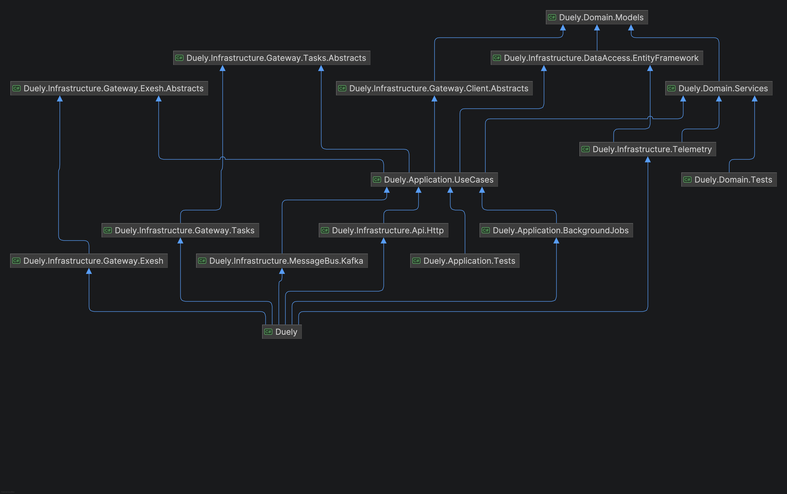
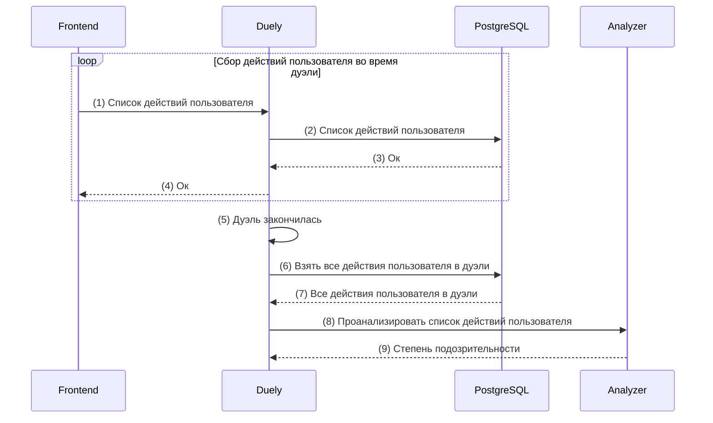

# Duely

Используется для управления пользователями, группами и дуэлями.

## Структура компонентов

Компоненты поделены на проекты / сборки по принципам чистой архитектуры.

## Анализ подозрительности пользователя

- Во время дуэли `Frontend` собирает список действий пользователя и с заданным интервалом передаёт его в `Duely` (1, 4)
- `Duely` сохраняет их в `PostgreSQL` (2, 3)
- После окончания дуэли (5) `Duely` берёт все сохранённые действия пользователя в дуэли из `PostgreSQL` (6, 7)
- Для анализа списка действий пользователя `Duely` делает запрос в `Analyzer` (8) и в ответе получает степень подозрительности (9)