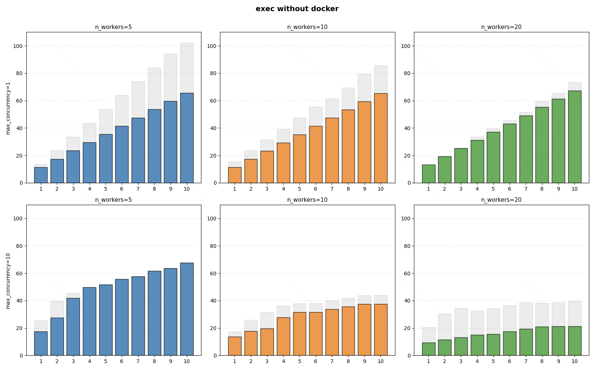

# Exesh

Используется для тестирования задачи, как песочница для запуска команд.

## Компоненты

Exesh состоит из двух компонентов:
- Coordinator - координация выполнения джоб
- Worker - выполнение джоб

### Coordinator

- Принимает запросы на запуск списка шагов тестирования.
- Распределяет джобы по worker'ам.
- Транслирует статусы выполнения шагов тестирования.

### Worker

- Получает от coordinator джобы.
- Выполняет команды, находящиеся в джобе.
- Сохраняет артефакт с выходными файлами джобы.

# Нагрузочное тестирование

Был проведён ряд экспериментов по нагрузочному тестированию системы для выявления узких мест и поиска лучшей конфигурации.

Во всех экспериментах было с разницей в одну секунду отправлено 10 решений задачи с 30 тестами.
Параметры, которые меняли:
- max_concurrency - максимальное количество одновременно тестируемых решений; были выбраны два значения:
    - 1 - все решения тестируются последовательно
    - 10 - все решения тестируются одновременно
- n_workers - количество worker'ов в системе: 5, 10, 20.

Выводы:
1. При увеличении n_worker решения тестируются быстрее, но больший прирост производительности дало увеличение с 5 до 10, а не с 10 до 20. Таким образом, оптимальным параметром можно считать значение 10. При дальнейшем увеличении прирост производительности будет незначительным.
2. При последовательном тестировании решений (concurrency_limit=1) видна ровная лестница, что говорит о том, что время тестирования каждого решения было примерно одинаковым.

Также была проведена вторая серия экспериментов с такой же конфигурацией, но все решения запускались не в docker-контейнерах, а напрямую в операционной системе.

Выводы:
1. При наложении графиков с запуском решений в docker-контейнерах видно, что тестирование решений стало заметно быстрее. Из этого можно сделать вывод, что тратится немалое время на запуск самих docker-контейнеров.
2. При последовательном тестировании решений увеличение значения n_workers привело к интересному наблюдению: при n_workers=5 явно видно разницу, а вот при n_workers=20 разницы практически нет. С другой стороны при одновременном тестировании решений ситуация наблюдается полностью противоположная. Вывод из этого пока что непонятен, так как сама ситуация считается странной.
