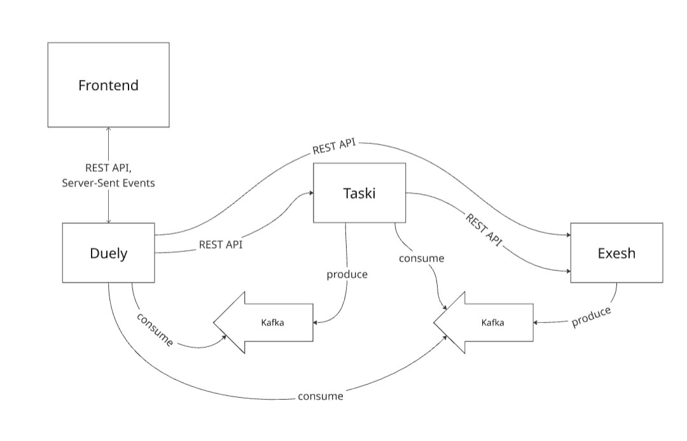
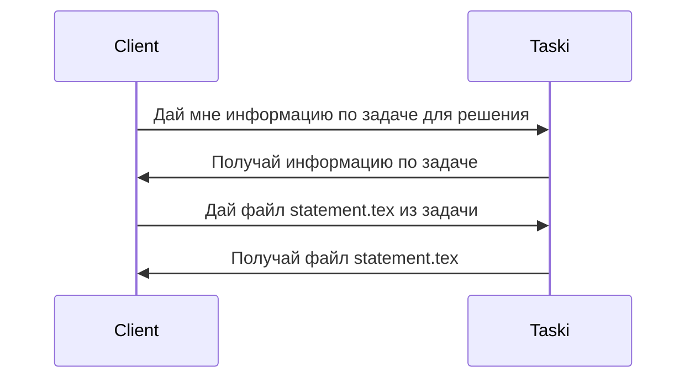
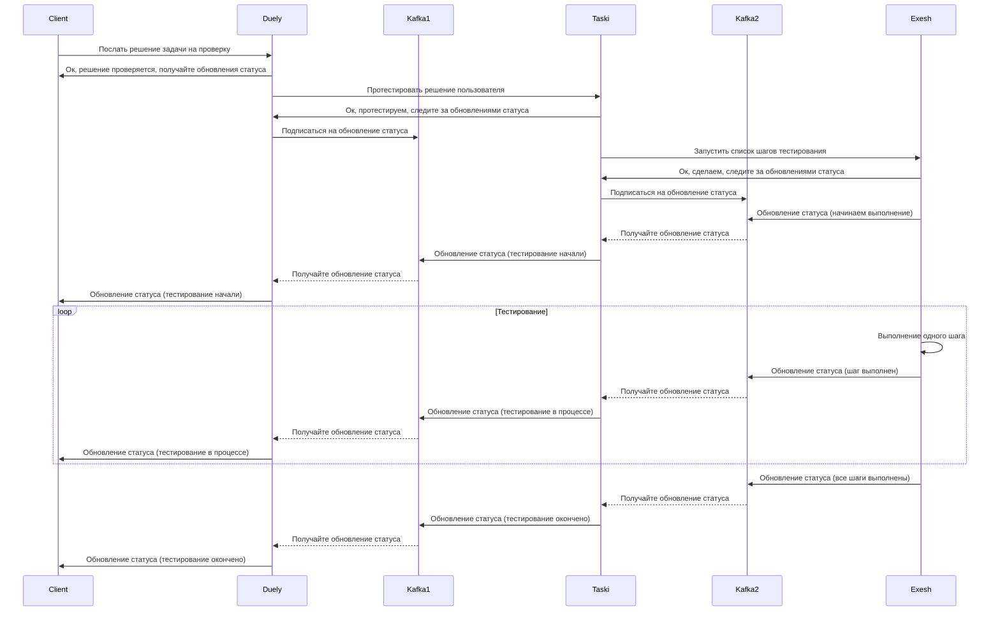
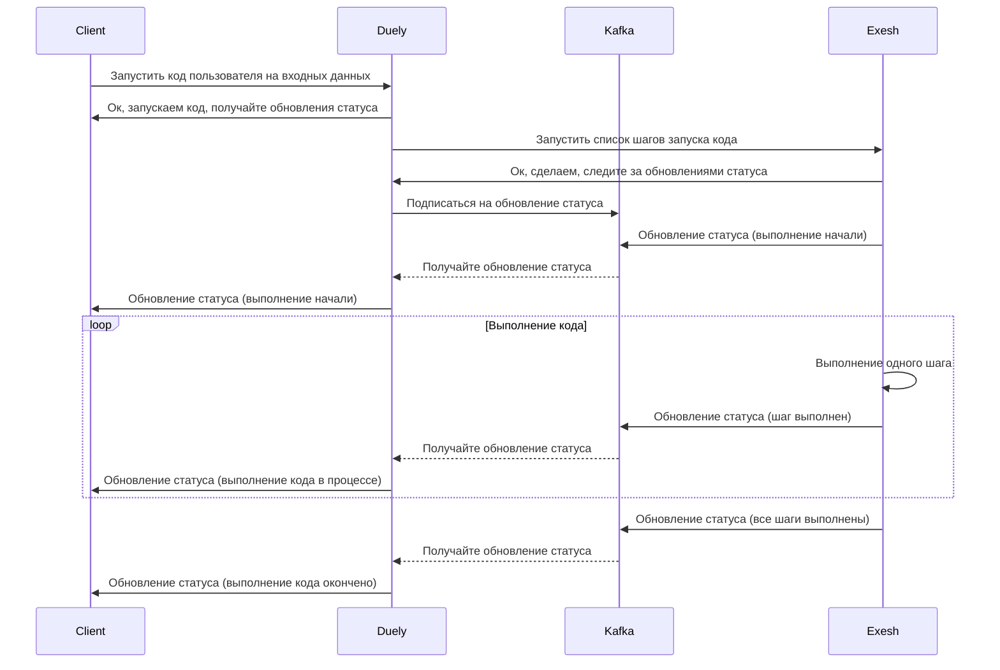

# Архитектура

## Компоненты

Система построена по микросервисной архитектуре и состоит из трёх ключевых компонентов:
1. Duely - управление пользователями и дуэлями.
2. Taski - хранение задач и управление проверкой решений.
3. Exesh - тестирование задач и выполнение кода.

### [Duely](components/Duely.md)

- Единственная входная точка для пользователя.
- Хранение пользователей, рейтинга.
- Подбор соперника для дуэли.
- Управление дуэлями.
- Выдача задачи для дуэли.
- Выдача информации про дуэль.
- Контроль за правилами и временем дуэли.
- Инициирование проверки решения.
- Хранение посылок участника дуэли.
- Получение вердикта.
- Завершение и формирование результата дуэли.
- Пересчёт рейтинга участников.
- Выдача истории дуэлей пользователя.

### [Taski](components/Taski.md)

- Хранение задач.
- Выдача информации по задаче пользователю для решения.
- Выдача файла задачи по запросу (например, условие / тесты).
- Выдача полного архива с задачей для тестирования.
- Проверка решения задачи, выдача вердикта тестирования.

### [Exesh](components/Exesh.md)

- Запуск списка шагов для тестирования задачи.
- Запуск кода пользователя на входных данных и выдача выходных данных.

## Взаимодействие компонентов

### Получение задачи

### Тестирование задачи

### Запуск кода пользователя на входных данных

## Деплоймент

