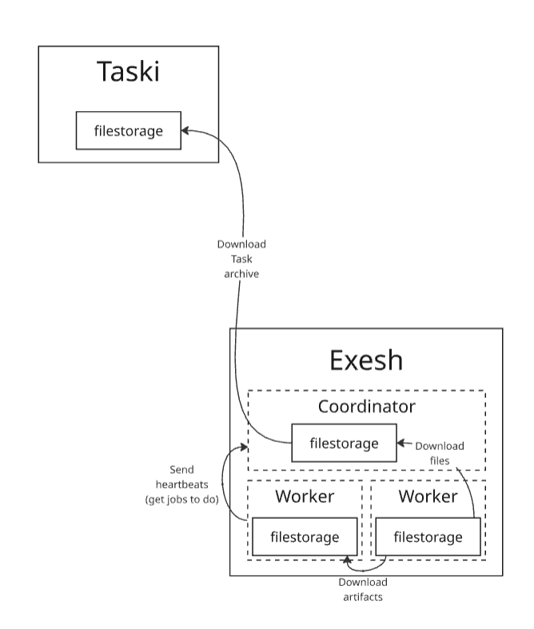
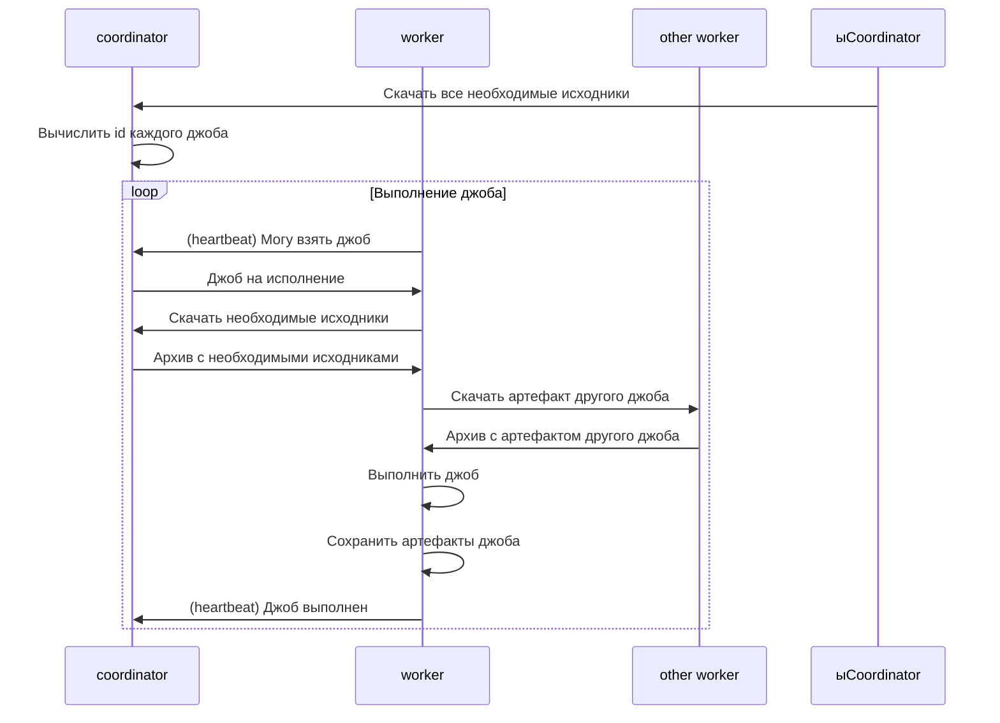

# Exesh

## Описание

- Запуск списка шагов для тестирования задачи.
- Запуск кода пользователя на входных данных и выдача выходных данных.

## Компоненты

Exesh состоит из двух компонентов:
- Coordinator - координация выполнения джоб
- Worker - выполнение джоб

### Coordinator

- Принимает запросы на запуск списка шагов тестирования.
- Распределяет джобы по worker'ам.
- Транслирует статусы выполнения шагов тестирования.

### Worker

- Получает от coordinator джобы.
- Выполняет команды, находящиеся в джобе.
- Сохраняет артефакт с выходными файлами джобы.

## Взаимодействие компонентов

### Выполнение графа джобов

## API
TODO

## Схема данных
TODO
