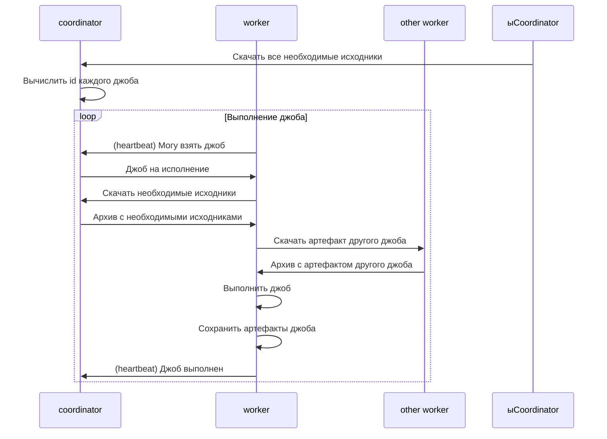
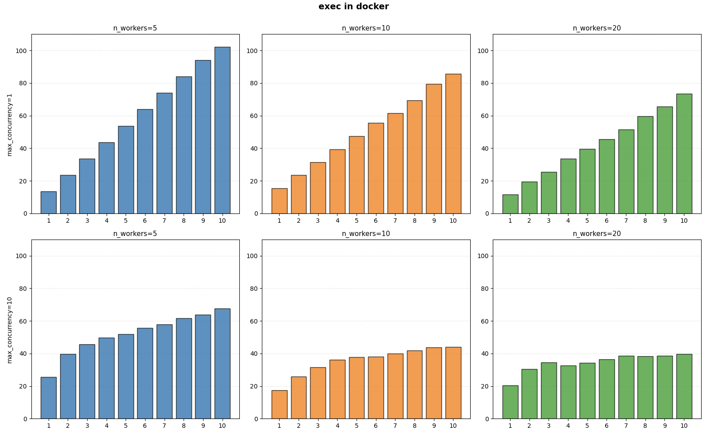

# Exesh

## Описание

- Запуск списка шагов для тестирования задачи.
- Запуск кода пользователя на входных данных и выдача выходных данных.

## Компоненты


Exesh состоит из двух компонентов:
- Coordinator - координация выполнения джоб
- Worker - выполнение джоб

### Coordinator

- Принимает запросы на запуск списка шагов тестирования.
- Распределяет джобы по worker'ам.
- Транслирует статусы выполнения шагов тестирования.

### Worker

- Получает от coordinator джобы.
- Выполняет команды, находящиеся в джобе.
- Сохраняет артефакт с выходными файлами джобы.

## Взаимодействие компонентов

### Выполнение графа джобов


## API

### Выполнение списка шагов

#### Запрос

`POST /execute`
```json
{
    "steps": [ $step, $step, ... ]
}
```

#### Ответ

Успех
```json
{
    "status": "OK",
    "execution_id": "4cf94aac-ae47-459b-bb6a-459784fecc66"
}
```

Ошибка
```json
{
    "status": "Error",
    "error": "ошибка"
}
```

### Строительные блоки, используемые для выполнения шагов

#### Исходные файлы

Исходные файлы, необходимые для выполнения шагов, могут быть одного из трёх типов:
1. Файлы, которые лежат в бакете в рамках пакета filestorage (например, файлы задачи)
```json
{
    "type": "filestorage_bucket",
    "bucket_id": "7d971f50363cf0aebbd87d971f50363cf0aebbd8",
    "download_endpoint": "http://localhost:5252",
    "file": "tests/01.in"
}
```
2. Файлы, которые передаются от пользователя (например, решение пользователя)
```json
{
    "type": "inline",
    "content": "print(sum(map(int, input().split())))\n"
},
```
3. Файлы, которые являются артефактами других шагов (например, скомпилированный C++ код)
```json
{
    "type": "other_step",
    "step_name": "compile correct"
},
```

#### Типы шагов

Шаг выполнения может быть одного из пяти типов:
1. Компиляция C++ кода
```json
{
    "name": "compile correct",
    "type": "compile_cpp",
    "code": { "$source" }
}
```
2. Запуск скомпилированного C++ кода
```json
{
    "name": "run correct on test 1",
    "type": "run_cpp",
    "compiled_code": { "$source" },
    "run_input": { "$source" },
    "time_limit": 2000,
    "memory_limit": 256,
    "show_output": false
}
```
3. Запуск Python кода
```json
{
    "name": "run suspect on test 1",
    "type": "run_py",
    "code": { "$source" },
    "run_input": { "$source" },
    "time_limit": 2000,
    "memory_limit": 256,
    "show_output": false
}
```
4. Запуск Golang кода
```json
{
    "name": "run suspect on test 1",
    "type": "run_go",
    "code": { "$source" },
    "run_input": { "$source" },
    "time_limit": 2000,
    "memory_limit": 256,
    "show_output": false
}
```
5. Проверка правильности ответа с помощью скомпилированного C++ чекера
```json
{
    "name": "check on test 1",
    "type": "check_cpp",
    "compiled_checker": { "$source" },
    "correct_output": { "$source" },
    "suspect_output": { "$source" }
}
```

### События обновления статуса выполнения шагов

Выполнение шагов началось
```json
{
    "execution_id": "4cf94aac-ae47-459b-bb6a-459784fecc66",
    "type": "start"
}
```
Выполнение шагов закончилось успешно
```json
{
    "execution_id": "4cf94aac-ae47-459b-bb6a-459784fecc66",
    "type": "finish"
}
```
Выполнение шагов закончилось с ошибкой
```json
{
    "execution_id": "4cf94aac-ae47-459b-bb6a-459784fecc66",
    "type": "finish",
    "error": "ошибка"
}
```

Компиляция кода прошла успешно
```json
{
    "execution_id": "4cf94aac-ae47-459b-bb6a-459784fecc66",
    "type": "compile",
    "step_name": "compile correct",
    "status": "OK"
}
```
Компиляция кода заверщилась с ошибкой
```json
{
    "execution_id": "4cf94aac-ae47-459b-bb6a-459784fecc66",
    "step_name": "compile correct",
    "status": "CE",
    "error": "ошибка компиляции бла-бла-бла"
}
```

Запуск кода прошел успешно
```json
{
    "execution_id": "4cf94aac-ae47-459b-bb6a-459784fecc66",
    "type": "run",
    "step_name": "run correct",
    "status": "OK"
}
```
Запуск кода прошел не успешно (RE/TL/ML)
```json
{
    "execution_id": "4cf94aac-ae47-459b-bb6a-459784fecc66",
    "type": "run",
    "step_name": "run correct",
    "status": "RE"
}
```
Запуск кода с показом вывода прошел успешно
```json
{
    "execution_id": "4cf94aac-ae47-459b-bb6a-459784fecc66",
    "type": "run",
    "step_name": "run code",
    "status": "OK",
    "output": "317"
}
```

Проверка ответа с использованием С++ чекера прошла успешно
```json
{
    "execution_id": "4cf94aac-ae47-459b-bb6a-459784fecc66",
    "type": "check",
    "step_name": "check on test 1",
    "status": "OK"
}
```
Проверка ответа с использованием С++ чекера прошла не успешно (WA)
```json
{
    "execution_id": "4cf94aac-ae47-459b-bb6a-459784fecc66",
    "type": "check",
    "step_name": "check on test 1",
    "status": "WA"
}
```

# Нагрузочное тестирование

Был проведён ряд экспериментов по нагрузочному тестированию системы для выявления узких мест и поиска лучшей конфигурации.

Во всех экспериментах было с разницей в одну секунду отправлено 10 решений задачи с 30 тестами.
Параметры, которые меняли:
- max_concurrency - максимальное количество одновременно тестируемых решений; были выбраны два значения:
    - 1 - все решения тестируются последовательно
    - 10 - все решения тестируются одновременно
- n_workers - количество worker'ов в системе: 5, 10, 20.



Выводы:
1. При увеличении n_worker решения тестируются быстрее, но больший прирост производительности дало увеличение с 5 до 10, а не с 10 до 20. Таким образом, оптимальным параметром можно считать значение 10. При дальнейшем увеличении прирост производительности будет незначительным.
2. При последовательном тестировании решений (concurrency_limit=1) видна ровная лестница, что говорит о том, что время тестирования каждого решения было примерно одинаковым.

Также была проведена вторая серия экспериментов с такой же конфигурацией, но все решения запускались не в docker-контейнерах, а напрямую в операционной системе.


Выводы:
1. При наложении графиков с запуском решений в docker-контейнерах видно, что тестирование решений стало заметно быстрее. Из этого можно сделать вывод, что тратится немалое время на запуск самих docker-контейнеров.
2. При последовательном тестировании решений увеличение значения n_workers привело к интересному наблюдению: при n_workers=5 явно видно разницу, а вот при n_workers=20 разницы практически нет. С другой стороны при одновременном тестировании решений ситуация наблюдается полностью противоположная. Вывод из этого пока что непонятен, так как сама ситуация считается странной.
