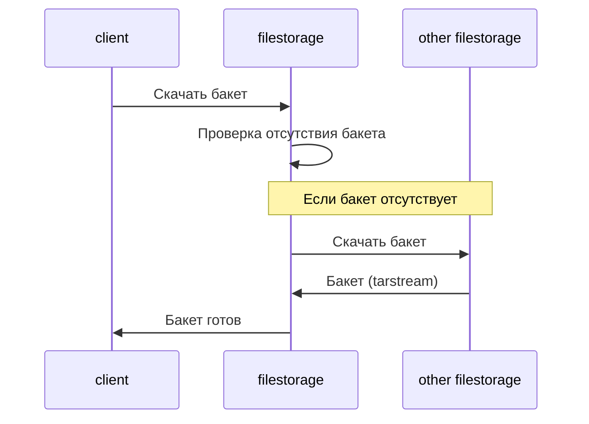

# filestorage

filestorage — подсистема хранения файлов - внутренний пакет на Go, используемый для хранения и обмена файловыми артефактами.

## Бакет

- Представляет собой папку, имя которой - 20 bytes.
- Может содержать только файлы и папки (не вложенные бакеты).

## Режимы хранения

- Постоянное — бессрочное.
- Временное — с указанием времени, после которого бакет удаляется.

## Передача бакетов

- По хешу через tarstream.
- Скачивание происходит только при отсутствии бакета локально.
- При передаче можно задать новое время хранения.
- Частичная загрузка: поддерживается скачивание одного файла бакета — по указанному пути внутри него.

