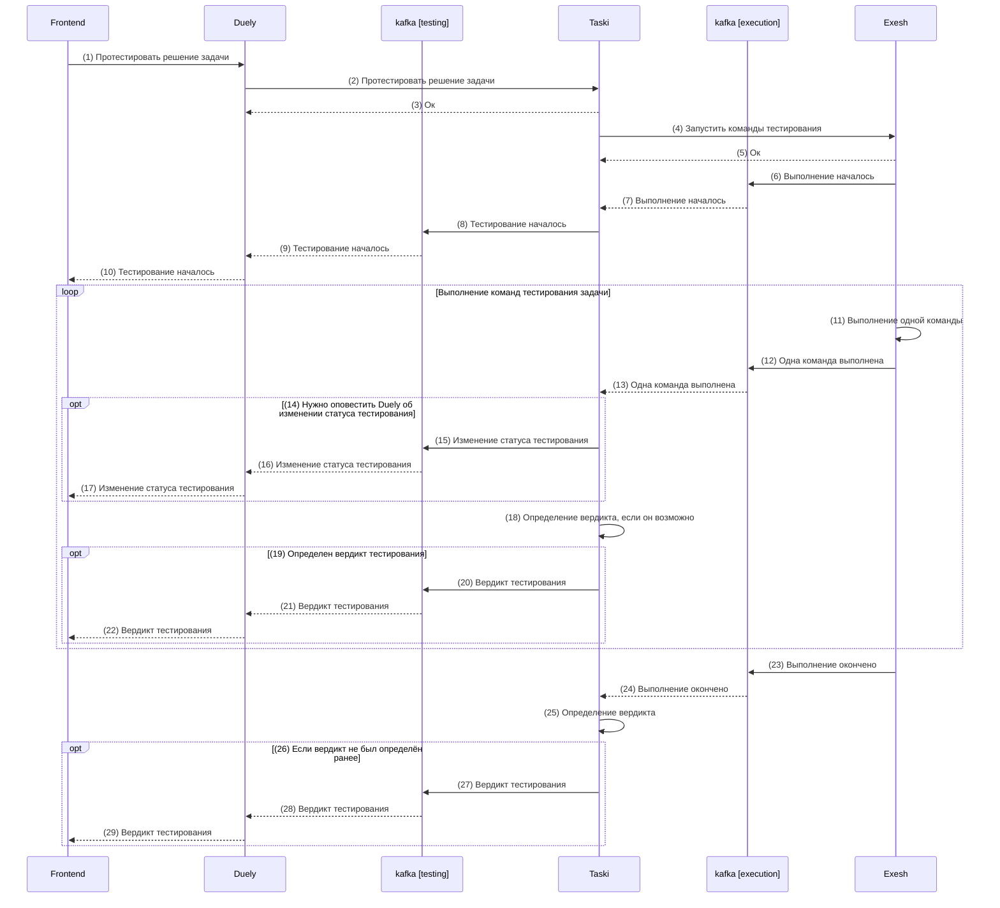
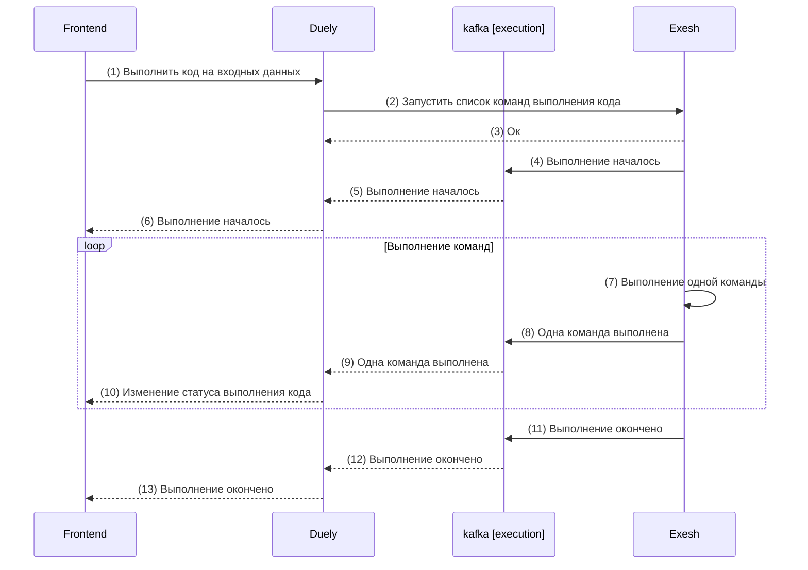

# Техническая реализация

## Архитектура

## Компоненты

1. [Frontend](components/Frontend/README.md) - взаимодействие с пользователем через браузер.
2. [Duely](components/Duely/README.md) - управление пользователями, группами и дуэлями.
3. [Taski](components/Taski/README.md) - хранение задач и управление проверкой решений.
4. [Exesh](components/Exesh/README.md) - тестирование задач и выполнение кода.
5. [FileStorage](components/FileStorage/README.md) - взаимодействие с файловой системой.

## Third-party компоненты

1. [Nginx](https://nginx.org)
2. [PostgreSQL](https://www.postgresql.org)
3. [Kafka](https://kafka.apache.org)

## Процессы

### Тестирование решения задачи

- `Frontend` имеет web-socket соединение с `Duely` через nginx и отправляет сообщение с запросом на тестирование решения задачи (1), а далее ожидает сообщения с изменением статуса тестирования в web-socket соединение
- `Duely` делает http запрос в `Taski` на тестирование решения задачи (2) и при успешном ответе (3) далее ожидает сообщения с изменением статуса тестирования в `kafka` из топика `testing`
- `Taski` делает http запрос в `Exesh` на запуск команд тестирования решения задачи (4) и при успешном ответе (5) далее ожидает сообщения с результатами выполнения команд в `kafka` из топика `execution`
- `Exesh` при запуске команд отправляет сообщение о начале выполнения команд в `kafka` в топик `execution` (6)
- `Taski` при получении сообщения о начале выполнения команд (7) отправляет сообщение о начале тестирования в `kafka` в топик `testing` (8)
- `Duely` при получении сообщения о начале тестирования (9) отправляет сообщение о начале тестирования в web-socket соединение с `Frontend` (10)
- `Exesh` при выполнении каждой команды (11) отправляет событие о выполнении команды в `kafka` в топик `execution` (12)
- `Taski` при получении сообщения о выполнении команды (13) отправляет сообщение об изменении статуса тестирования в `kafka` в топик `testing` (15), если нужно оповестить `Duely` об этом (14)
- `Duely` при получении сообщения об изменении статуса тестирования отправляет сообщение об изменении статуса тестирования в web-socket соединение с `Frontend` (16)
- `Taski` после получения каждого сообщения о выполнении команд (13) определяет вердикт тестирования (18), если его можно определить (19), и отправляет его в `kafka` в топик `testing` (20)
- `Exesh` при окончании выполнения команд отправляет сообщение о завершении выполнения команд в `kafka` в топик `execution` (23)
- `Taski` при получении сообщения об окончании выполнения команд (24) определяет вердикт тестирования (25), если он не был определен ранее (26), и отправляет его в `kafka` в топик `testing` (27)
- `Duely` при получении сообщения с вердиктом (21, 28) тестирования отправляет его в web-socket соединение с `Frontend` (22, 29)

### Выполнить код на входных данных

- `Frontend` имеет web-socket соединение с `Duely` через nginx и отправляет сообщение с запросом на тестирование решения задачи (1), а далее ожидает сообщения с изменением статуса тестирования в web-socket соединение
- `Duely` отправляет http запрос в `Exesh` на запуск команд выполнения кода (2) и при успешном ответе (3) далее ожидает сообщения с результатами выполнения команд в `kafka` из топика `execution`
- `Exesh` при запуске команд отправляет сообщение о начале выполнения команд в `kafka` в топик `execution` (4)
- `Duely` при получении сообщения о начале выполнения команд (5) отправляет сообщение о начале тестирования в web-socket соединение с `Frontend` (6)
- `Exesh` при выполнении каждой команды (7) отправляет событие о выполнении команды в `kafka` в топик `execution` (8)
- `Duely` при получении сообщения о выполнении команды (9) отправляет сообщение об изменении статуса выполнения кода в web-socket соединение с `Frontend` (10)
- `Exesh` при окончании выполнения команд отправляет сообщение о завершении выполнения команд в `kafka` в топик `execution` (11)
- `Duely` при получении сообщения об окончании выполнения команд (12) отправляет в web-socket соединение с `Frontend` сообщение об окончании выполнения кода (13)

## Деплоймент

